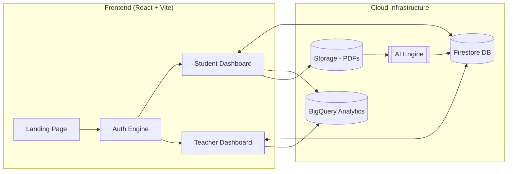
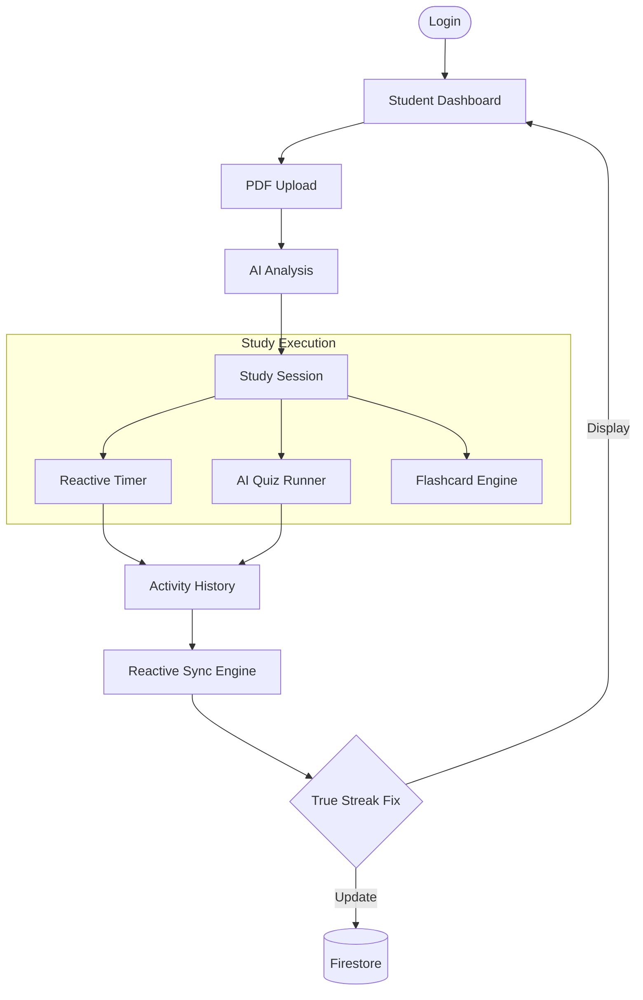
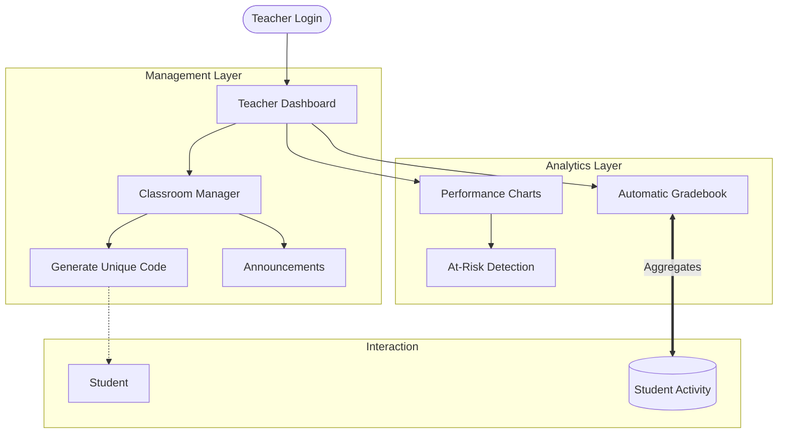
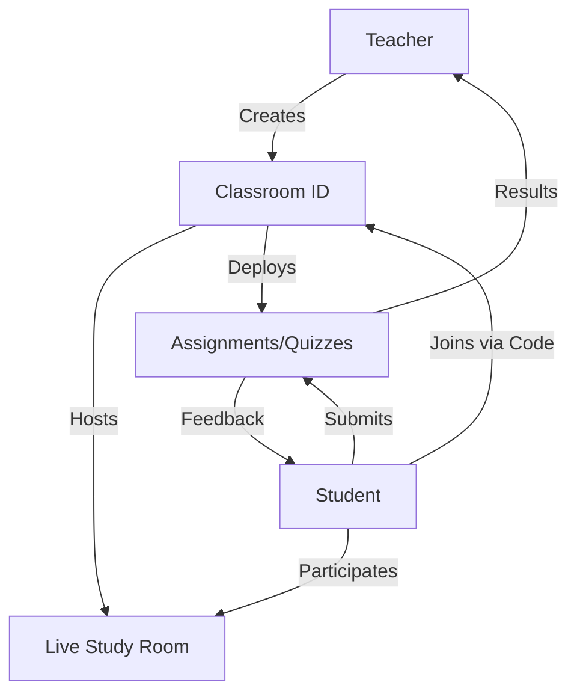
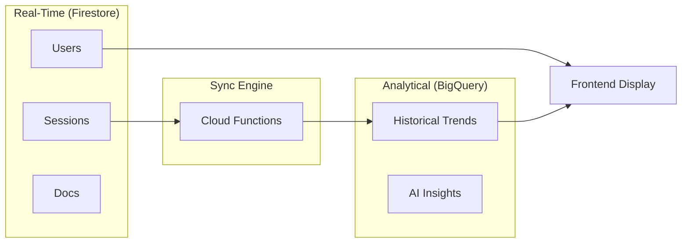

# 🌐 Study-Gloqe System Architecture

This guide provides a visual map of the Study-Gloqe platform, illustrating how components, data, and users interact.

---

## 🏗️ Core Platform Map
The high-level relationship between the client application and cloud services.

---

## 👨‍🎓 Student: The Learning Journey
How a student moves from raw content to refined knowledge.

---

## 👨‍🏫 Teacher: Oversight & Management
How a teacher manages classrooms and tracks student growth.

---

## 🔗 The Bridge: Classroom Connection
The shared space where Teachers and Students intersect.

---

## 📊 Data Flow Architecture
The relationship between real-time data and long-term analytical data.

---

## 🎨 Visual Design System (Tokens)
| Module | Theme | Key Interaction |
| :--- | :--- | :--- |
| **Core** | Glassmorphic | Framer Motion Layouts |
| **Student** | Vibrant / Gamified | Streak Fire Animations |
| **Teacher** | Professional / Clean | Dynamic Data Tables |
| **Analytics** | Dark Mode Hero | interactive Chart.js Views |
