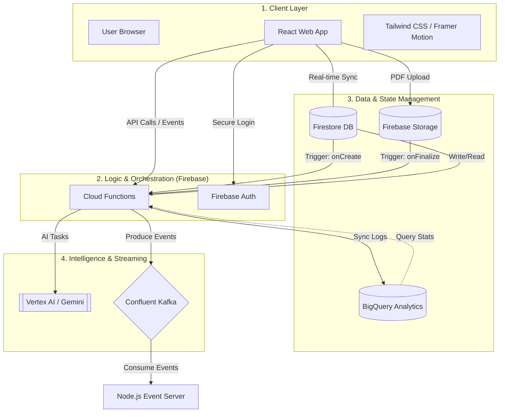

# 🏗️ StudyGloqe System Architecture

This document provides a detailed overview of the technologies powering StudyGloqe and how they are interconnected to create a seamless, AI-driven learning experience.

## 🗺️ Master Architecture Diagram

The following diagram illustrates the high-level flow of data and control between the frontend, the core backend services, and the auxiliary intelligence/streaming layers.

---

## 🛠️ Technology Breakdown

StudyGloqe is built on a modern "Serverless+" architecture, leveraging specialized cloud services for scale and intelligence.

### 1. ⚡ Confluent Kafka (Real-Time Event Bus)
*   **Usage**: Handles high-throughput real-time events such as study sessions, quiz completions, and gamification updates. It ensures the system is loosely coupled and scalable.
*   **Connectivity**: **Cloud Functions** act as producers, publishing events to topics in Confluent Cloud. An external **Node.js Server** (in the `/Server` directory) consumes these events to provide real-time updates (like live leaderboards) via Server-Sent Events (SSE).

### 2. 📊 BigQuery (Data Warehouse)
*   **Usage**: Used for long-term analytical storage and complex data processing. While Firestore handles live state, BigQuery stores structured historical data for generating deep learning insights.
*   **Connectivity**: **Cloud Functions** ingest data into BigQuery tables (e.g., `study_sessions`, `quiz_completions`). The system then queries BigQuery to provide historical performance trends to both students and teachers.

### 3. 🧠 Vertex AI (Intelligence Layer)
*   **How it's used**: Powers the automated content generation core. It utilizes **Gemini 2.5** to analyze study materials, detect subjects, and instantly generate quizzes and flashcards.
*   **Connectivity**: Integrated within **Cloud Functions**. Triggered automatically upon document upload, it processes text extracts and returns structured data that is then stored in Firestore.

### 4. 🔥 Firestore (Real-Time Database)
*   **How it's used**: The "Source of Truth" for application state. It stores user profiles, classroom data, document metadata, and real-time interaction states.
*   **Connectivity**: Directly connected to the **React Frontend** for real-time synchronization. It also acts as an event source for **Cloud Functions** (database triggers) to initiate backend workflows.

### 5. ☁️ Cloud Functions (Backend Orchestrator)
*   **How it's used**: The serverless backbone that executes complex logic, enforces security, and integrates diverse cloud services.
*   **Connectivity**: Acts as the central hub connecting the **Frontend** to **Vertex AI**, **BigQuery**, **Kafka**, and **Firestore**. It responds to HTTP requests and lifecycle events across the platform.

---

## 🔄 Core Workflow: Document Success Journey

1.  **Ingestion**: User uploads a document; **Firestore** records the metadata.
2.  **Enrichment**: **Cloud Functions** trigger **Vertex AI** to classify the subject and generate a quiz.
3.  **Broadcast**: **Cloud Functions** produce a `document.processed` event to **Confluent Kafka**.
4.  **Analytics**: The processing metadata is synced to **BigQuery** for long-term tracking.
5.  **Activation**: The student sees the new "Smart Quiz" instantly via **Firestore** real-time listeners.
