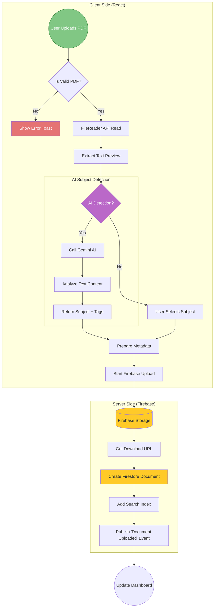
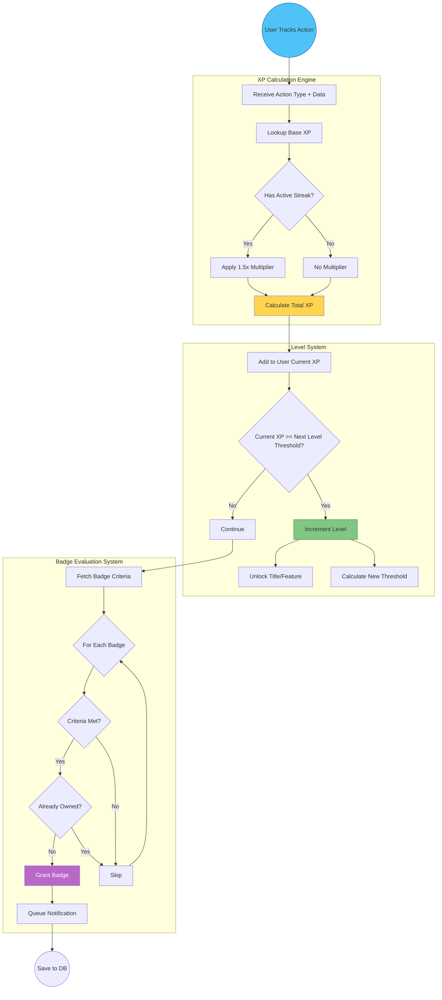
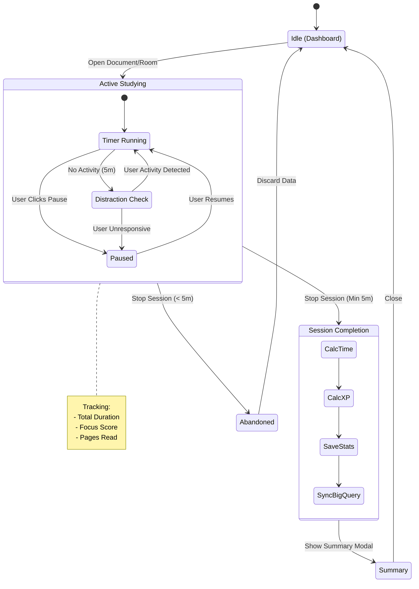
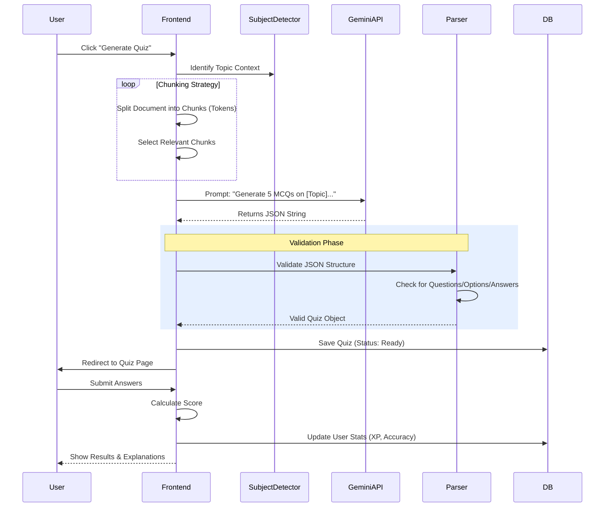
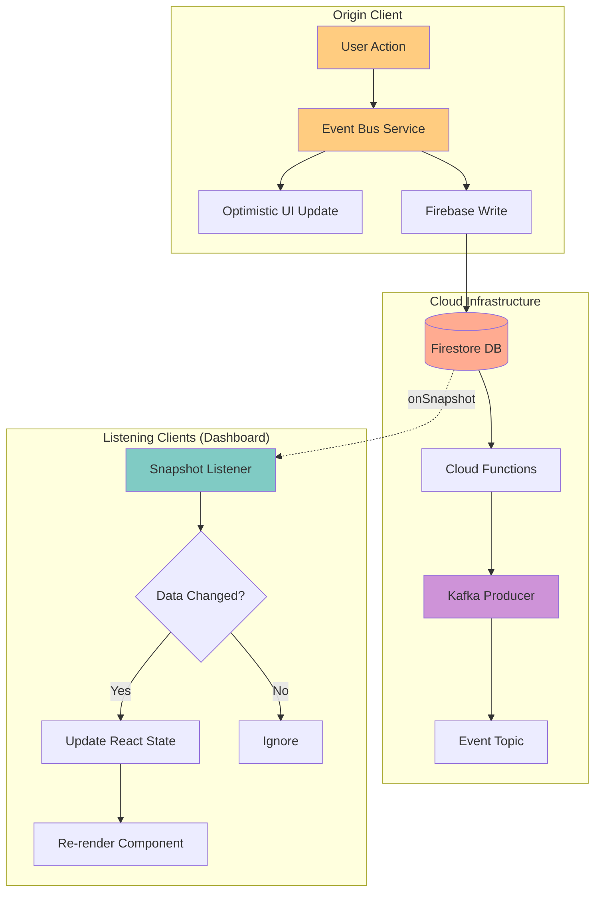

# Study-Gloqe: Deep-Dive Logic Flowcharts

> **Detailed algorithmic flows for key application systems.**  
> _Use this document to understand the "How" and "Why" of the system's logic._

---

## 1. 📄 Document Processing & AI Subject Detection Pipeline
*The exact journey a PDF takes from user drag-and-drop to becoming a study resource.*

---

## 2. 🎮 The Gamification Engine Logic
*How the system decides when to level up a user or award a badge.*

---

## 3. ⏱️ The Study Session Lifecycle
*The state machine governing a user's active study time.*

---

## 4. 🤖 AI Quiz Generation Flow
*From raw text to an interactive quiz using Gemini.*

---

## 5. ⚡ Realtime Event Synchronization
*The technical data path for keeping all clients in sync.*

---

## How to use:
*   **Developers**: Use diagrams 2, 3, and 5 to understand the code logic before refactoring.
*   **Pitch Deck**: Diagram 1 is excellent for showing "How it Works".
*   **QA Team**: Use Diagram 3 to test edge cases in study sessions (e.g., distraction checks).
