# Study-Gloqe: Technical Architecture for Pitch Deck

> **Visualizing the Future of AI-Powered Education**  
> _Optimized diagrams for investor presentations & technical overview._

---

## 1. The Study-Gloqe Ecosystem (High-Level)
*Use this slide to demonstrate the holistic connection between students, teachers, and AI.*

```mermaid
graph TB
    subgraph "👥 The Users"
        STUDENT([👨‍🎓 Student])
        TEACHER([👩‍🏫 Teacher])
    end

    subgraph "🚀 The Platform (Study-Gloqe)"
        UI[Interactive Dashboard]
        
        subgraph "⚡ Real-time Features"
            LIVE[Live Study Rooms]
            COLLAB[Collaborative Docs]
            QUIZ[Instant Quizzes]
        end
        
        subgraph "🤖 AI Core"
            COACH[AI Study Coach]
            GEN[Content Generator]
            ANALYTICS[Smart Analytics]
        end
    end
    
    subgraph "☁️ Cloud Infrastructure"
        FIRE[Firebase Realtime]
        KAFKA[Confluent Kafka Stream]
        BQ[BigQuery Insights]
    end

    STUDENT <--> UI
    TEACHER <--> UI
    
    UI <--> LIVE
    UI <--> COACH
    
    LIVE <--> FIRE
    COACH <--> GEN
    
    GEN -.->|Events| KAFKA
    KAFKA -.->|Big Data| BQ
    BQ -.->|Insights| ANALYTICS
    ANALYTICS --> TEACHER
    
    style STUDENT fill:#29b6f6,color:#fff,stroke:#0277bd
    style TEACHER fill:#66bb6a,color:#fff,stroke:#2e7d32
    style UI fill:#eceff1,stroke:#b0bec5
    style LIVE fill:#fff3e0,stroke:#ffb74d
    style COACH fill:#f3e5f5,stroke:#ab47bc
    style KAFKA fill:#212121,color:#fff
    style BQ fill:#4285f4,color:#fff
```



---

## 2. The Realtime AI Engine
*Use this slide to explain the "Secret Sauce" - how user actions turn into personalized learning.*

```mermaid
graph LR
    subgraph "Step 1: Ingest"
        DOC[📄 Document Upload]
        ACT[🖱️ User Action]
    end
    
    subgraph "Step 2: Process (The Brain)"
        GEMINI[✨ Gemini AI]
        EVENT_BUS[⚡ Event Stream]
    end
    
    subgraph "Step 3: Output (Value)"
        FLASH[🗂️ Auto-Flashcards]
        QUIZZES[📝 Auto-Quizzes]
        STATS[📈 Live Progress]
    end

    DOC -->|Subject Detection| GEMINI
    ACT -->|Realtime Track| EVENT_BUS
    
    GEMINI -->|Generate| FLASH
    GEMINI -->|Generate| QUIZZES
    
    EVENT_BUS -->|Analyze| STATS
    STATS -->|Feedback| ACT
    
    style GEMINI fill:#8e24aa,color:#fff
    style EVENT_BUS fill:#ff6f00,color:#fff
    style FLASH fill:#a5d6a7
    style QUIZZES fill:#90caf9
    style STATS fill:#ffcc80
```



---

## 3. Enterprise-Grade Scale
*Use this slide to prove technical robustness and scalability.*

```mermaid
graph TB
    Client[📱 Web Client (React + Vite)]
    
    subgraph "🛡️ Security & API Layer"
        AUTH[Firebase Auth]
        EDGE[Cloud Functions]
    end
    
    subgraph "💾 Data Layer"
        RT_DB[(Firestore NoSQL)]
        STREAM[(Kafka Event Bus)]
        WAREHOUSE[(BigQuery OLAP)]
    end
    
    Client -->|Secure Access| AUTH
    Client -->|API Calls| EDGE
    
    EDGE <-->|Realtime Sync| RT_DB
    EDGE -->|High Throughput| STREAM
    STREAM -->|Analytics Pipeline| WAREHOUSE
    
    style Client fill:#37474f,color:#fff
    style AUTH fill:#ffca28
    style EDGE fill:#ff7043,color:#fff
    style RT_DB fill:#ffa726
    style STREAM fill:#212121,color:#fff
    style WAREHOUSE fill:#4285f4,color:#fff
```

---

## How to use these in your Pitch Deck:

1.  **Screenshots**: You can take screenshots of these rendered diagrams directly.
2.  **Mermaid Live Editor**: Copy the code blocks above into [Mermaid Live Editor](https://mermaid.live/) to customize colors, save as high-res PNG/SVG, or transparent backgrounds.
3.  **Re-draw**: Use these logical flows as blueprints for a designer to create custom graphics in Figma or Canva.
