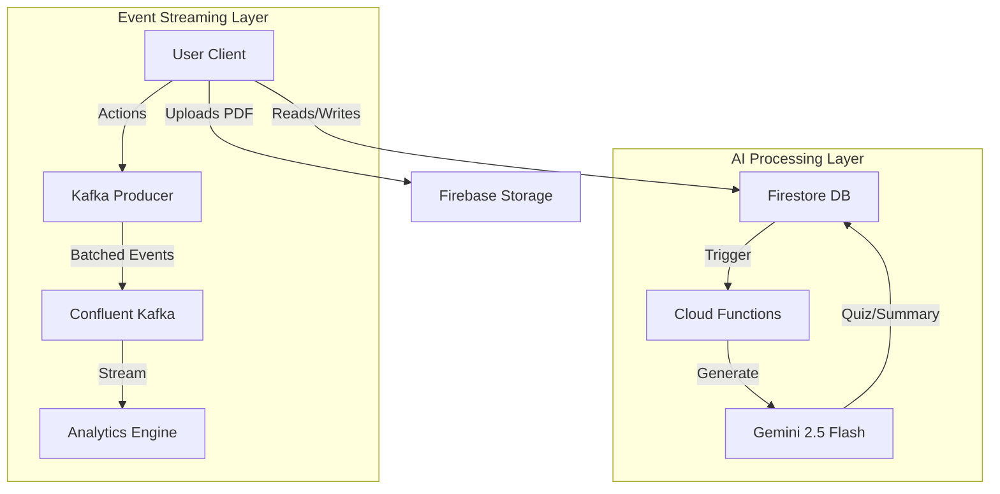

# 🎓 StudyGloqe - Next-Gen AI Learning Platform
Copyright © 2025 Sagar Singh Airee

Licensed under the Apache License, Version 2.0 (the "License");
you may not use this file except in compliance with the License.
You may obtain a copy of the License at

    http://www.apache.org/licenses/LICENSE-2.0

📝 License: Apache License 2.0 (OSI-approved, commercial use permitted)

<div align="center">


**Transforming education with scalable event-driven architecture and state-of-the-art Generative AI.**

[Demo](https://study-gloqe.web.app) • [Documentation](#) • [Report Bug](#)

</div>

---

## 🌟 Enterprise-Grade Integrations

StudyGloqe is not just another LMS; it's a technical showcase of modern, scalable cloud architecture, deeply integrated with industry-leading ecosystem partners.

### 🚀 Powered by Confluent Kafka
At the heart of our platform lies a robust, **event-driven architecture** powered by Confluent Kafka, ensuring real-time data consistency and high scalability.

- **Event Bus System**: A custom `KafkaProducer` service orchestrates all system activities, decoupling microservices for maximum reliability.
- **Smart Batching**: Implements intelligent event batching (10-event windows with 5s flush intervals) to optimize network throughput and reduce latency.
- **Real-time Topics**:
  - `study.events`: Tracks user focus, session duration, and learning patterns.
  - `quiz.events`: Real-time scoring, answer validation, and adaptivity metrics.
  - `gamification.events`: Instant XP awards, leveling up, and badge distribution.
  - `analytics.events`: Deep telemetry for user behavior analysis.

```javascript
// Example: The system automatically batches and streams study events
await kafkaProducer.produceStudyEvent({
  type: 'SESSION_START',
  userId: 'user_123',
  metadata: { subject: 'Physics', goal: 'Quantum Mechanics' }
});
```

### 🧠 Google Cloud & Gemini AI Ecosystem
We leverage the full power of the Google Cloud ecosystem, utilizing **Gemini 2.5 Flash** for unmatched speed and intelligence.

- **Generative AI Core (Gemini 2.5 Flash)**:
  - **Instant Quiz Generation**: Transforms any PDF into complex multi-choice quizzes in seconds.
  - **Cognitive Mind Maps**: Generates hierarchical concept maps to visualize complex topics.
  - **Contextual Summaries**: "Chat with your PDF" functionality with pinpoint accuracy.
  - **Visual Analysis**: Extracts insights from charts, diagrams, and images within study materials.
- **Firebase Backend-as-a-Service**:
  - **Auth**: Secure, seamless social authentication.
  - **Firestore**: NoSQL document database for flexible data modeling.
  - **Cloud Functions**: Serverless compute for event processing and AI orchestration.

---

## ✨ Key Features

### 📚 Intelligent Document Processing
- **Smart Upload**: Auto-detects subjects and categorizes documents using AI.
- **Visual Learning**: Automatically generates flowcharts and summaries from raw text.

### 🎮 Gamified Learning Experience
- **XP & Levels**: Earn experience for every minute studied and quiz passed.
- **Leaderboards**: Real-time class and global rankings to drive competition.
- **Badges**: Unlockable achievements (e.g., "Night Owl", "Quiz Master").

### 👩‍🏫 Teacher Command Center
- **Classroom Management**: Create classes, assign documents, and track student health.
- **Deep Analytics**: View class performance distributions and identifying struggling students.
- **Monthly Rewards**: Automated system to calculate and award top performers.

---

## 🛠️ Technical Stack

- **Frontend**: React 18, Tailwind CSS, Framer Motion
- **AI/ML**: Google Gemini 2.5 Flash, Vertex AI
- **Streaming**: Confluent Cloud (Kafka)
- **Backend**: Firebase (Functions, Firestore, Auth, Storage)
- **3D Visuals**: Spline
- **Deployment**: Firebase Hosting / GitHub Actions

---

## 🚀 Getting Started

### Prerequisites
- Node.js 18+
- Firebase Project
- Gemini API Key

### Installation

1. **Clone the repository**
   ```bash
   git clone https://github.com/yourusername/study-gloqe.git
   cd study-gloqe
   ```

2. **Install dependencies**
   ```bash
   npm install
   ```

3. **Configure Environment**
   Create a `.env` file in the root directory:
   ```env
   VITE_FIREBASE_API_KEY=your_key
   VITE_GEMINI_API_KEY=your_gemini_key
   # ... other firebase config
   ```

4. **Run Development Server**
   ```bash
   npm run dev
   ```

## 📁 Architecture Overview



## 🤝 Contributing

We welcome contributions! Please see our [Contributing Guide](CONTRIBUTING.md) for details.

1. Fork the Project
2. Create your Feature Branch (`git checkout -b feature/AmazingFeature`)
3. Commit your Changes (`git commit -m 'Add some AmazingFeature'`)
4. Push to the Branch (`git push origin feature/AmazingFeature`)
5. Open a Pull Request

## 📄 License

Distributed under the Apache License 2.0. See `LICENSE` for more information.

📝 License: Apache License 2.0 (OSI-approved, commercial use permitted)

---

<div align="center">
  <p>Built with ❤️ by Sagar </p>
</div>
