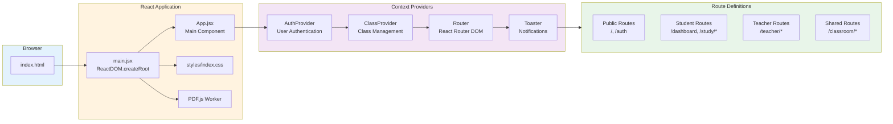
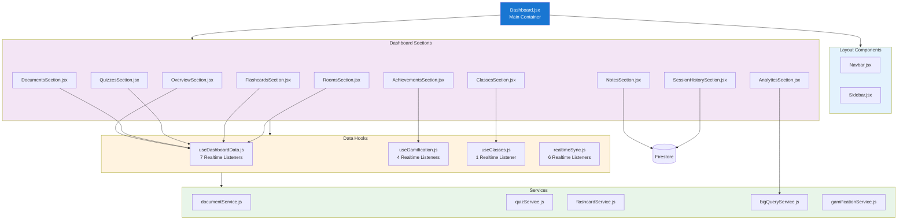
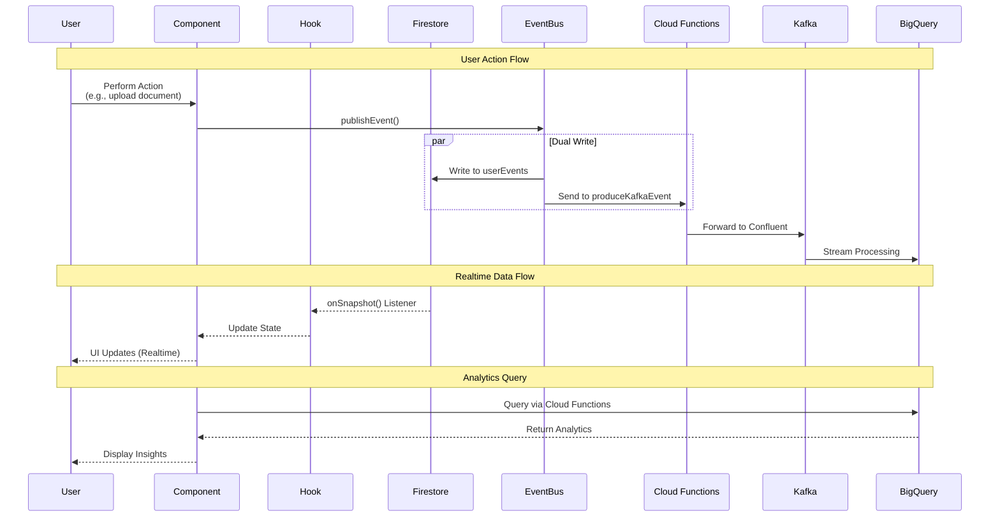
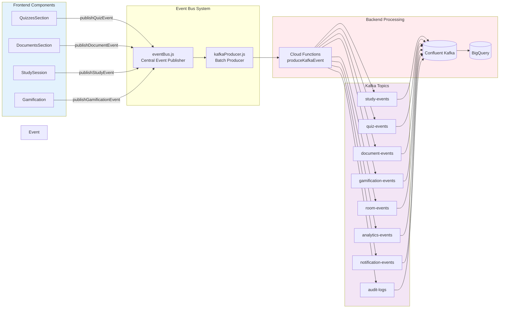
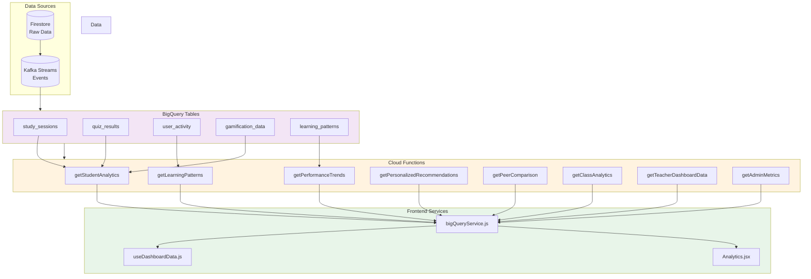
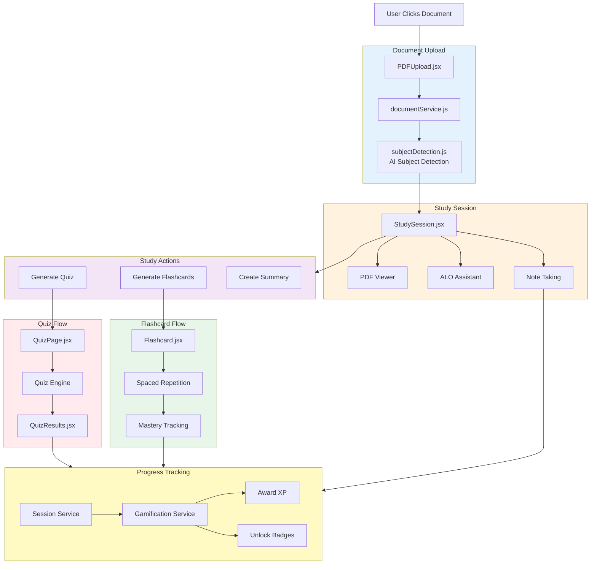
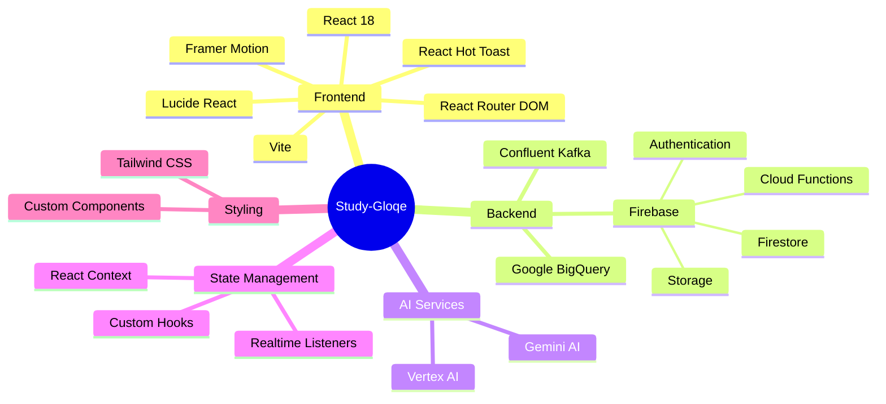

# Study-Gloqe Complete Architecture Flowcharts

> **Comprehensive codebase architecture visualization**  
> Generated: 2025-12-17

---

## Table of Contents

1. [High-Level Architecture](#1-high-level-architecture)
2. [Application Entry Point Flow](#2-application-entry-point-flow)
3. [Feature Modules Overview](#3-feature-modules-overview)
4. [Routing Architecture](#4-routing-architecture)
5. [Student Dashboard Component Hierarchy](#5-student-dashboard-component-hierarchy)
6. [Data Flow - Realtime Architecture](#6-data-flow---realtime-architecture)
7. [Service Layer Architecture](#7-service-layer-architecture)
8. [Authentication Flow](#8-authentication-flow)
9. [Kafka Event Streaming](#9-kafka-event-streaming)
10. [BigQuery Analytics Pipeline](#10-bigquery-analytics-pipeline)
11. [Study Session Flow](#11-study-session-flow)
12. [File Dependencies Map](#12-file-dependencies-map)

---

## 1. High-Level Architecture

```mermaid
graph TB
    subgraph Entry["🚀 Application Entry"]
        MAIN[main.jsx]
        APP[App.jsx]
    end
    
    subgraph Providers["📦 Context Providers"]
        AUTH[AuthProvider]
        CLASS[ClassProvider]
        ROUTER[React Router]
    end
    
    subgraph Features["🎯 Feature Modules"]
        STUDENT[Student]
        TEACHER[Teacher]
        STUDY[Study]
        ANALYTICS[Analytics]
        CLASSROOM[Classroom]
        GAMIFICATION[Gamification]
        LANDING[Landing]
        AUTHM[Auth]
    end
    
    subgraph Shared["🔧 Shared Resources"]
        CONFIG[Config]
        SERVICES[Services]
        COMPONENTS[Components]
        UTILS[Utils]
    end
    
    subgraph Backend["☁️ Backend Services"]
        FIRESTORE[(Firestore)]
        FUNCTIONS[Cloud Functions]
        KAFKA[Confluent Kafka]
        BIGQUERY[BigQuery]
    end
    
    MAIN --> APP
    APP --> ROUTER
    ROUTER --> AUTH
    ROUTER --> CLASS
    AUTH --> Features
    CLASS --> Features
    Features --> Shared
    Shared --> Backend
    
    style Entry fill:#e3f2fd
    style Providers fill:#fff3e0
    style Features fill:#f3e5f5
    style Shared fill:#e8f5e9
    style Backend fill:#fff9c4
```



---

## 2. Application Entry Point Flow



---

## 3. Feature Modules Overview

```mermaid
graph TB
    subgraph Student["👨‍🎓 Student Module"]
        SD[Dashboard.jsx]
        SP[Pages]
        SC[Components]
        SH[Hooks]
    end
    
    subgraph Teacher["👩‍🏫 Teacher Module"]
        TD[TeacherDashboard.jsx]
        TC[TeacherClassroom.jsx]
        TP[Pages]
        TCmp[Components]
        TS[Services]
    end
    
    subgraph Study["📚 Study Module"] 
        PDF[PDFUpload.jsx]
        READER[PDFReader.jsx]
        SESSION[StudySession.jsx]
        QUIZ[QuizPage.jsx]
        FLASH[Flashcard.jsx]
        ROOM[StudyRoom.jsx]
    end
    
    subgraph Analytics["📊 Analytics Module"]
        AN[Analytics.jsx]
        CHARTS[Charts]
        WIDGETS[Widgets]
        HOOKS[Hooks]
        SERV[Services]
    end
    
    subgraph Gamification["🎮 Gamification Module"]
        GAM_COMP[Components]
        GAM_HOOKS[useGamification.js]
        GAM_SERV[Services]
    end
    
    subgraph Classroom["🏫 Classroom Module"]
        CLASS_PAGE[ClassroomPage.jsx]
        CLASS_CTX[ClassContext.jsx]
        CLASS_TABS[Tab Components]
    end
    
    subgraph Auth["🔐 Auth Module"]
        AUTH_PAGE[AuthPage.jsx]
        AUTH_CTX[AuthContext.jsx]
    end
    
    subgraph Landing["🌐 Landing Module"]
        LAND[LandingPage.jsx]
    end
    
    Student --> Analytics
    Student --> Gamification
    Student --> Classroom
    Teacher --> Classroom
    Study --> Analytics
    Study --> Gamification
    Auth -.-> Student
    Auth -.-> Teacher
    Landing -.-> Auth
    
    style Student fill:#bbdefb
    style Teacher fill:#c8e6c9
    style Study fill:#fff9c4
    style Analytics fill:#f8bbd0
    style Gamification fill:#d1c4e9
    style Classroom fill:#ffccbc
    style Auth fill:#b2dfdb
    style Landing fill:#f0f4c3
```

---

## 4. Routing Architecture

```mermaid
graph TB
    ROOT[/ Root]
    
    subgraph Public["Public Routes"]
        LANDING[/]
        AUTH[/auth]
    end
    
    subgraph Student["Student Routes<br/>StudentRoute Guard"]
        DASH[/dashboard]
        UPLOAD[/upload]
        STUDY[/study/:docId]
        QUIZ[/quiz/:quizId]
        FLASH[/flashcards/:deckId]
        ROOM[/study-room/:roomId]
        PROFILE[/profile]
        SETTINGS[/settings]
        ANALYTICS[/analytics]
        CLASS_DETAIL[/classes/:classId]
    end
    
    subgraph Teacher["Teacher Routes<br/>TeacherRoute Guard"]
        TEACH_DASH[/teacher/dashboard]
        TEACH_CLASS[/teacher/class/:classId]
    end
    
    subgraph Shared["Shared Routes<br/>ProtectedRoute Guard"]
        CLASSROOM[/classroom/:classId]
    end
    
    ROOT --> Public
    ROOT --> Student
    ROOT --> Teacher
    ROOT --> Shared
    
    LANDING -.-> AUTH
    AUTH -.->|Student Login| DASH
    AUTH -.->|Teacher Login| TEACH_DASH  
    
    style Public fill:#e3f2fd
    style Student fill:#f3e5f5
    style Teacher fill:#e8f5e9
    style Shared fill:#fff3e0
```

---

## 5. Student Dashboard Component Hierarchy



---

## 6. Data Flow - Realtime Architecture



---

## 7. Service Layer Architecture

```mermaid
graph TB
    subgraph Shared Services["🔧 Shared Services"]
        FIREBASE[firebase.js<br/>Firebase SDK Config]
        GEMINI[gemini.js<br/>AI Configuration]
        EVENT[eventBus.js<br/>Event Publisher]
        KAFKA[kafkaProducer.js<br/>Kafka Client]
        SYNC[realtimeSync.js<br/>Unified Metrics]
    end
    
    subgraph Feature Services["📦 Feature Services"]
        DOC[documentService.js<br/>Document CRUD]
        QUIZ[quizService.js<br/>Quiz Generation]
        FLASH[flashcardService.js<br/>Flashcard CRUD]
        CLASS[classService.js<br/>Class Management]
        GAM[gamificationService.js<br/>XP/Badges/Levels]
        ANALYTICS[analyticsService.js<br/>Analytics Processing]
        BQ[bigQueryService.js<br/>BigQuery Queries]
    end
    
    subgraph AI Services["🤖 AI Services"]
        GEMINI_ANALYTICS[geminiAnalytics.js]
        STUDY_COACH[aiStudyCoach.js]
        VERTEX[vertexAI.js]
    end
    
    subgraph Utils["🛠️ Utils"]
        SUBJECT[subjectDetection.js]
        HELPERS[helpers.js]
        ID[idGenerator.js]
        CLEANUP[useSessionCleanup.js]
    end
    
    subgraph Backend["☁️ Backend"]
        FB[(Firestore)]
        FN[Cloud Functions]
        KF[Confluent Kafka]
        BQD[BigQuery]
    end
    
    Feature Services --> Shared Services
    Feature Services --> AI Services 
    Feature Services --> Utils
    Shared Services --> Backend
    AI Services --> Backend
    
    FIREBASE --> FB
    EVENT --> FN
    KAFKA --> FN
    FN --> KF
    BQ --> FN
    FN --> BQD
    
    style Shared Services fill:#e3f2fd
    style Feature Services fill:#f3e5f5
    style AI Services fill:#fff3e0
    style Utils fill:#e8f5e9
    style Backend fill:#ffebee
```

---

## 8. Authentication Flow

```mermaid
graph TB
    START[User Visits Site]
    
    subgraph Auth["Authentication Module"]
        AUTH_PAGE[AuthPage.jsx<br/>Login/Signup UI]
        AUTH_CTX[AuthContext.jsx<br/>Auth State Management]
    end
    
    subgraph Firebase["Firebase Auth"]
        GOOGLE[Google OAuth]
        EMAIL[Email/Password]
        FB_AUTH[(Firebase Auth)]
    end
    
    subgraph App["Application"]
        APP_COMP[App.jsx]
        GUARDS{Route Guards}
    end
    
    subgraph Routes["Protected Routes"]
        PUBLIC[PublicRoute]
        STUDENT[StudentRoute]
        TEACHER[TeacherRoute]
        PROTECTED[ProtectedRoute]
    end
    
    subgraph Dashboards["User Dashboards"]
        STUD_DASH[/dashboard<br/>Student Dashboard]
        TEACH_DASH[/teacher/dashboard<br/>Teacher Dashboard]
    end
    
    START --> AUTH_PAGE
    AUTH_PAGE --> GOOGLE
    AUTH_PAGE --> EMAIL
    GOOGLE --> FB_AUTH
    EMAIL --> FB_AUTH
    FB_AUTH --> AUTH_CTX
    AUTH_CTX --> APP_COMP
    APP_COMP --> GUARDS
    
    GUARDS --> PUBLIC
    GUARDS --> STUDENT
    GUARDS --> TEACHER
    GUARDS --> PROTECTED
    
    STUDENT -->|Role: Student| STUD_DASH
    TEACHER -->|Role: Teacher| TEACH_DASH
    
    style Auth fill:#e3f2fd
    style Firebase fill:#fff3e0
    style App fill:#f3e5f5
    style Routes fill:#e8f5e9
    style Dashboards fill:#ffebee
```

---

## 9. Kafka Event Streaming



---

## 10. BigQuery Analytics Pipeline



---

## 11. Study Session Flow



---

## 12. File Dependencies Map

```mermaid
graph TB
    subgraph Entry["Entry Point"]
        MAIN[main.jsx]
        APP[App.jsx]
    end
    
    subgraph Core Config["Core Configuration"]
        FB[firebase.js]
        GEM[gemini.js]
        VITE[vite.config.js]
        TSCONFIG[tsconfig.json]
    end
    
    subgraph Contexts["Context Providers"]
        AUTH_C[AuthContext.jsx]
        CLASS_C[ClassContext.jsx]
    end
    
    subgraph Student Files["Student Feature (24 files)"]
        S_DASH[Dashboard.jsx]
        S_PAGES[Pages/]
        S_COMP[Components/]
        S_HOOKS[Hooks/]
    end
    
    subgraph Teacher Files["Teacher Feature (16 files)"]
        T_DASH[TeacherDashboard.jsx]
        T_CLASS[TeacherClassroom.jsx]
        T_COMP[Components/]
        T_SERV[Services/]
    end
    
    subgraph Study Files["Study Feature (20 files)"]
        ST_PDF[PDFUpload.jsx]
        ST_READ[PDFReader.jsx]
        ST_SESSION[StudySession.jsx]
        ST_QUIZ[QuizPage.jsx]
        ST_FLASH[Flashcard.jsx]
        ST_ROOM[StudyRoom.jsx]
        ST_SERV[Services/]
    end
    
    subgraph Analytics Files["Analytics Feature (23 files)"]
        A_PAGE[Analytics.jsx]
        A_CHARTS[Charts/]
        A_WIDGETS[Widgets/]
        A_HOOKS[Hooks/]
        A_SERV[Services/]
    end
    
    subgraph Gamification Files["Gamification Feature (13 files)"]
        G_COMP[Components/]
        G_HOOKS[useGamification.js]
        G_SERV[Services/]
    end
    
    subgraph Classroom Files["Classroom Feature (12 files)"]
        CL_PAGE[ClassroomPage.jsx]
        CL_CTX[ClassContext.jsx]
        CL_TABS[Tab Components/]
        CL_SERV[Services/]
    end
    
    subgraph Shared Files["Shared (13 files)"]
        SH_COMP[Components/]
        SH_CONFIG[Config/]
        SH_SERV[Services/]
        SH_UTILS[Utils/]
    end
    
    MAIN --> APP
    APP --> Contexts
    APP --> Student Files
    APP --> Teacher Files
    
    Contexts --> Core Config
    Student Files --> Shared Files
    Teacher Files --> Shared Files
    Study Files --> Shared Files
    Analytics Files --> Shared Files
    Gamification Files --> Shared Files
    Classroom Files --> Shared Files
    
    Shared Files --> Core Config
    
    AUTH_C -.->|Uses| FB
    CLASS_C -.->|Uses| FB
    S_DASH -.->|Uses| S_HOOKS
    S_HOOKS -.->|Uses| SH_SERV
    
    style Entry fill:#1976d2,color:#fff
    style Core Config fill:#e3f2fd
    style Contexts fill:#fff3e0
    style Student Files fill:#f3e5f5
    style Teacher Files fill:#e8f5e9
    style Study Files fill:#fff9c4
    style Analytics Files fill:#ffebee
    style Gamification Files fill:#d1c4e9
    style Classroom Files fill:#ffccbc
    style Shared Files fill:#b2dfdb
```

---

## Summary Statistics

| Category | Count |
|----------|-------|
| **Total Files** | ~150+ |
| **Feature Modules** | 8 |
| **Shared Services** | 3 |
| **Shared Components** | 3 |
| **Utils** | 5 |
| **Contexts** | 2 |
| **Realtime Listeners** | 18+ |
| **Cloud Functions** | 10+ |
| **Kafka Topics** | 8 |
| **Route Guards** | 4 |

---

## Key Connections

### Most Connected Files

1. **firebase.js** - Used by all services and hooks
2. **eventBus.js** - Connected to all user actions
3. **AuthContext.jsx** - Required by all protected routes
4. **useDashboardData.js** - Aggregates 7 Firestore collections
5. **bigQueryService.js** - Connects to 10+ Cloud Functions

### Critical Data Flows

1. **User Action** → EventBus → Firestore + Kafka → BigQuery → Analytics
2. **Authentication** → AuthContext → Route Guards → Feature Modules
3. **Document Upload** → Subject Detection → Study Session → Gamification
4. **Study Session → Quiz/Flashcards → Results → XP/Badges

---

## Technology Stack



---

## Next Steps for Optimization

1. **Code Splitting**: Implement lazy loading for feature modules
2. **Bundle Analysis**: Optimize bundle sizes per route
3. **Caching Strategy**: Implement service worker for offline support
4. **Error Boundaries**: Add error boundaries to each feature
5. **Performance Monitoring**: Add analytics for component render times
